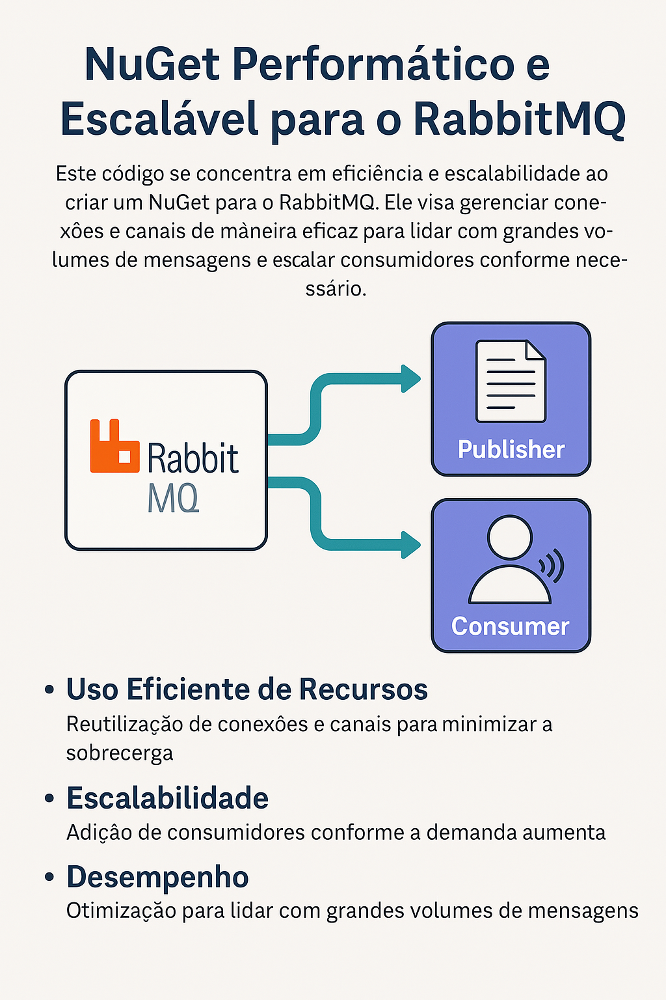

# NuGet RabbitMQ Performático com .NET 8

Você já precisou usar RabbitMQ em múltiplos projetos e se viu repetindo a mesma lógica de conexão, canal e publicação?  
Ou pior: enfrentou problemas de consumo de memória e canais abertos demais em produção?

Este pacote NuGet resolve isso:

🔗 [github.com/andrerodriguescorte/micro-saas-rabbit-mq](https://github.com/andrerodriguescorte/micro-saas-rabbit-mq)

> Um template para criação de **bibliotecas NuGet robustas e reutilizáveis com RabbitMQ**, 100% baseada em boas práticas de performance e resiliência.

---

## 🚀 Funcionalidades

- ✅ Conexão e canal reaproveitados (singleton)
- ✅ Publicação performática com fallback automático
- ✅ Consumo contínuo via handler injetável (`IRabbitConsumerHandler<T>`)
- ✅ Pull sob demanda com `RabbitPullConsumer`
- ✅ Logging estruturado com Serilog + ILogger<T>
- ✅ Compatível com qualquer aplicação .NET 8 (API, Console, Worker)

---

## 📦 Como usar

### 1. Instale o pacote NuGet

```bash
dotnet add package FidelizarMais.Shared.Microservice.RabbitMQ
```

### 2. Registre os serviços

```csharp
services.AddRabbit(configuration["RabbitMQ:Uri"]);
services.AddSingleton<IRabbitConsumerHandler<MinhaMensagem>, MinhaMensagemHandler>();
services.AddRabbitConsumer<MinhaMensagem, MinhaMensagemHandler>("nome-da-fila");
```

### 3. Publique uma mensagem

```csharp
await publisher.PublishAsync("", "nome-da-fila", new MinhaMensagem());
```

### 4. Consuma com handler injetável

```csharp
public class MinhaMensagemHandler : IRabbitConsumerHandler<MinhaMensagem>
{
    public Task HandleAsync(MinhaMensagem message)
    {
        Console.WriteLine("Recebido: " + message.Conteudo);
        return Task.CompletedTask;
    }
}
```

---

## 🧩 Arquitetura

- `RabbitConnectionManager` → Singleton da conexão física
- `RabbitPublisher` → Envia mensagens garantindo existência da fila
- `RabbitConsumer<T>` → Consome mensagens via DI e handler assíncrono
- `RabbitPullConsumer` → Consumo sob demanda com `.ObterMensagem(...)`

---

## ✅ Vantagens

- 💨 Alta performance
- ♻️ Reutilizável como NuGet
- 📊 Observável com logs Serilog
- 🔌 Compatível com apps simples e distribuídos

---

## ⚠️ Limitações

- Não lida automaticamente com DLX/requeue
- Focado em exchanges padrão (`""`) e filas diretas

---

## 🧪 Exemplo

- Publicação de 1000 mensagens em múltiplas filas (`fila-teste-1` até `fila-teste-100`)
- Consumo com `RabbitPullConsumer` em sequência
- Log em `logs/app.log`

---

## 🖼 Diagrama Explicativo



---

## 📎 Repositório

[https://github.com/andrerodriguescorte/micro-saas-rabbit-mq](https://github.com/andrerodriguescorte/micro-saas-rabbit-mq)
